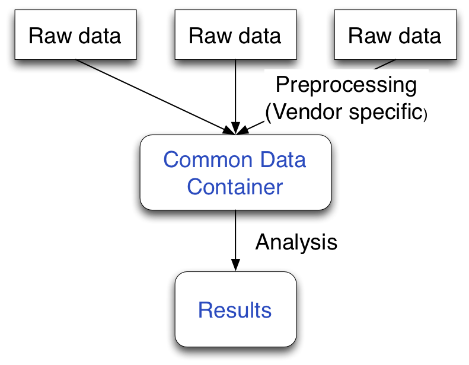
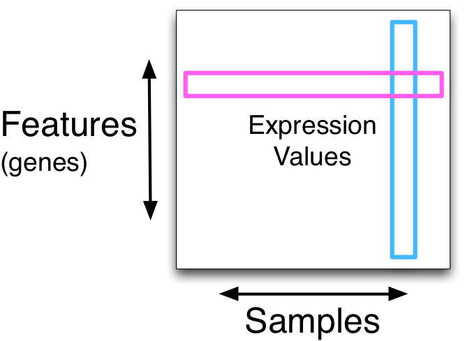
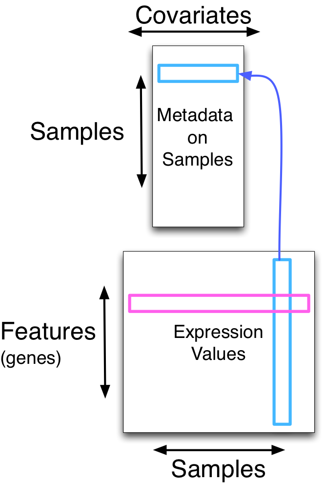
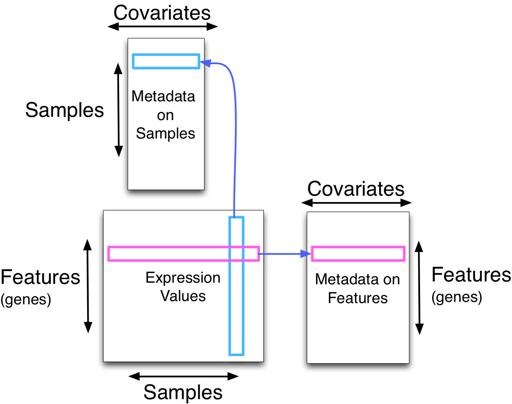
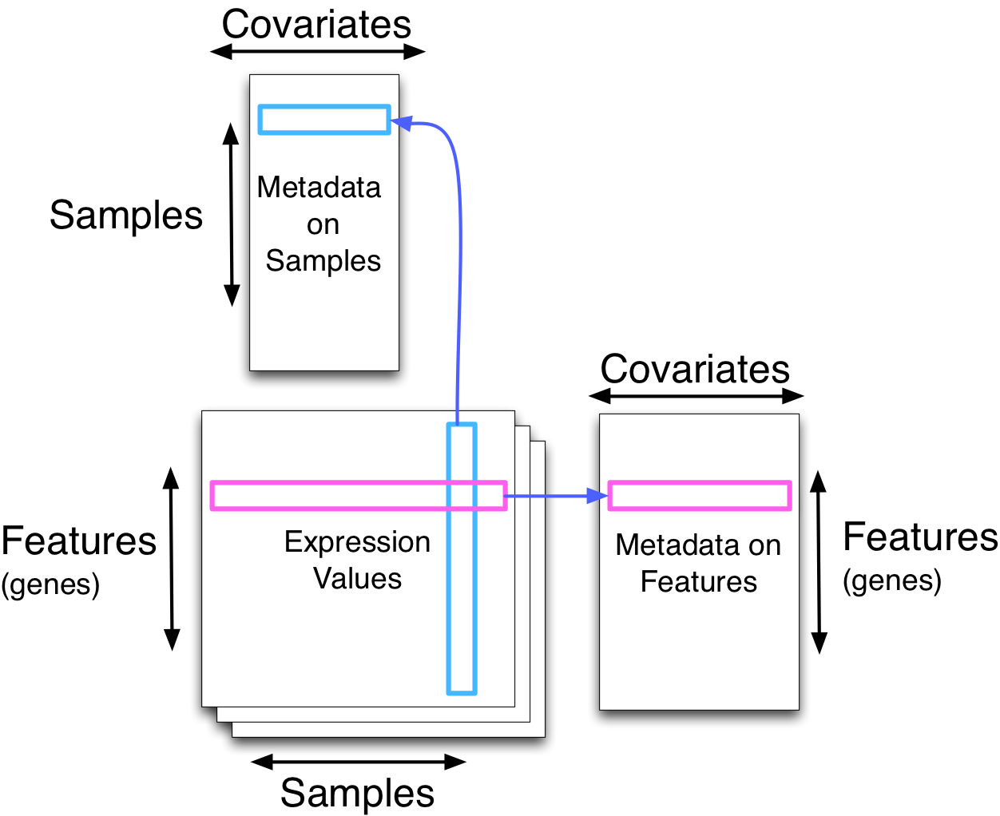

```{r front, child="front.Rmd", echo=FALSE}
```

## Dependencies

This document has the following dependencies:

```{r dependencies, warning=FALSE, message=FALSE}
library(Biobase)
library(ALL)
library(hgu95av2.db)
```

Use the following commands to install these packages in R.

```{r biocLite, eval=FALSE}
source("http://www.bioconductor.org/biocLite.R")
biocLite(c("Biobase", "ALL", "hgu95av2.db"))
```

## Overview
  
We will examine how to use and manipulate the `ExpressionSet` class; a fundamental data container in Bioconductor.  The class is defined in the `r Biocpkg("Biobase")` package.

This class has inspired many other data containers in Bioconductor.  It is a great example of _programming with data_.

# Data Containers

R/Bioconductor has a rich set of data containers, or types of objects for storing different types of genomic data.  Data containers might seem a boring subject at first, but in my opinion, they have been critical to the success of Bioconductor.  Don't just take my word for it; the following quote is from Robert Gentleman (co-creator of R and founder of Bioconductor) on successful computational biology software [@softwareAnatomy]:

> If everybody puts their gene expression data into the same kind of box, it doesn’t matter how the data came about, but that box is the same and can be used by analytic tools

The classic example is gene expression microarray data.  In Bioconductor, data from such an experiment goes through the following pipeline

1. Data is read into Bioconductor from a vendor specific file format and stored as raw data in a vendor specific data container.
2. The raw data is preprocessed, using statistical and computational methods which are specific to the vendor specific data.
3. After preprocessing, the data is stored in an `ExpressionSet` data container.

For example, data from Affymetrix microarrays and Agilent microarrays have (in their raw version) aspects of the data which are different to each vendor.  Affymetrix uses short oligonucleotide probes and therefore uses multiple probes to measure a single gene.  In contrast, Agilent uses long(er) probes and typically uses a single probe to measure a gene.  But after preprocessing, both platforms have a set of measurements on a set of genes.  At this level, the data becomes similar.

{#id .class width=2.637in height=2.053in}

Having well designed data containers allows developer to write methods for these data containers which will be applicable to many types of use cases.  And it helps users by making the data easier to manipulate; thereby reducing errors.

# The structure of an ExpressionSet

Gene expression data can be thought of as a data matrix of expression values, one for each (gene, sample) pair. Tradition demands that rows are genes and columns are samples.  Genes are sometimes called features.  An example of this is

{#id .class width=2.22in height=1.63in}

We always have additional data on the samples, often called covariates or phenotype data.  This is represented in a new data matrix; this time samples are in the rows and covariates are in the columns.  There is an implicit link between columns of the gene expression data matrix and rows of the phenotype matrix.  An example of this is

{#id .class width=2.22in height=3.297in}

You can think of the phenotype information as annotation on the columns of the expression matrix.  We also allow annotation on the rows of the expression matrix.  This is additional information on each _gene_ in the matrix, such as name, location and GC content.  Historically, this has been used less in Bioconductor.  An full depiction of an `ExpressionSet` is seen here:

{#id .class width=4.173in height=3.297in}

The `ExpressionSet` construction has been used for many other ttypes of data, besides gene expression data.  A general class, allowing for multiple data matrices, is an `eSet` depicted below.

{#id .class width=4.173in height=3.407in}

Examples of the need for multiple data matrices are DNA methylation microarrays where two measurements are obtained for each feature (a methylated and an unmethylated channel).

## Example

An example dataset, stored as an `ExpressionSet` is available in the `r Biocexptpkg("ALL")` package.  This package is an example of an "experimental data" package"; a bundling of a full experiment inside an R package.  These experimental data packages are used for teaching, testing and illustration, but can also serve as the documentation of a data analysis.

```{r ALL}
library(ALL)
data(ALL)
ALL
```
(you don't always have to explicitly call `data()` on all datasets in R; that depends on the choice of the package author).

This is an experiment done on an Affymetrix HGU 95av2 gene expression microarray; the authors profiled 128 samples.

Because this is data from an experiment package, there is documentation in the help page for the dataset, see
```{r help, eval=FALSE}
?ALL
```

From the printed description of `ALL` you can see that 12625 features (in this case genes) were measured on 128 samples.  The object contains information about the experiment; look at
```{r experimentData}
experimentData(ALL)
```
Two papers (pubmed IDs or PMIDs) are associated with the data.

There is no `protocolData` in the object (this is intended to describe the experimental protocol); this is typical in my experience (although it would be great to have this information easily available to the end user).

The core of the object are two matrices

- the `exprs` matrix containing the 12625 gene expression measurements on the 128 samples (a 12625 by 128 numeric matrix).
- the `pData` `data.frame` containing phenotype data on the samples.

You get the expression data by
```{r exprs}
exprs(ALL)[1:4, 1:4]
```
Note how this matrix has column and rownames.  These are `sampleNames` and `featureNames`.  Get them by
```{r names}
head(sampleNames(ALL))
head(featureNames(ALL))
```
To get at the `pData` information, using the `pData` accessor.
```{r pData}
head(pData(ALL))
```
You can access individual columns of this `data.frame` by using the `$` operator:
```{r dollar}
head(pData(ALL)$sex)
head(ALL$sex)
```

## Subsetting

Subsetting of this object is an important operation.  The subsetting has two dimensions; the first dimension is genes and the second is samples.  It keeps track of how the expression measures are matched to the pheno data.

```{r subset}
ALL[,1:5]
ALL[1:10,]
ALL[1:10,1:5]
```
We can even change the order of the samples
```{r subset2}
ALL[, c(3,2,1)]
ALL$sex[c(1,2,3)]
ALL[, c(3,2,1)]$sex
```
This gives us a lot of confidence that the data is properly matched to the phenotypes.

## featureData and annotation

You can think of `pData` as providing information on the columns (samples) of the measurement matrix.  Similar to `pData`, we have `featureData` which is meant to provide information on the features (genes) of the array.

However, while this slot has existed for many years, it often goes unused:
```{r featureData}
featureData(ALL)
```

So this leaves us with a key question: so far the `ALL` object has some useful description of the type of experiment and which samples were profiled.  But how do we get information on which genes were profiled?

For commercially available microarrays, the approach in Bioconductor has been to make so-called annotation packages which links `featureNames` to actual useful information.  Conceptually, this information could have been stored in `featureData`, but isn't.

Example
```{r annotation}
ids <- featureNames(ALL)[1:5]
ids
```
these are ids named by Affymetrix, the microarray vendor.  We can look them up in the annotation package by
```{r annotation2}
library(hgu95av2.db)
as.list(hgu95av2ENTREZID[ids])
```
This gives us the Entrez ID associated with the different measurements.  There are a number of so-called "maps" like `hgu95av2XX` with `XX` having multiple values.  This approach is very specific to Affymetrix chips.  An alternative to using annotation packages is to use the `r Biocpkg("biomaRt")` package to get the microarray annotation from Ensembl (an online database).  This will be discussed elsewhere.

We will leave the annotation subject for now.

## Note: phenoData and pData

For this type of object, there is a difference between `phenoData` (an object of class `AnnotatedDataFrame`) and `pData` (an object of class `data.frame`).

The idea behind `AnnotatedDataFrame` was to include additional information on what a `data.frame` contains, by having a list of descriptions called `varLabels`.

```{r varLabels}
pD <- phenoData(ALL)
varLabels(pD)
```

But these days, it seems that `varLabels` are constrained to be equal to the column names of the `data.frame` making the entire `AnnotatedDataFrame` construction unnecessary:

```{r varLabels2}
varLabels(pD)[2] <- "Age at diagnosis"
pD
colnames(pD)[1:3]
varLabels(pD)[1:3]
```

So now we have exposed what is arguably a bug, together with some un-used abstraction.  This happens.

## The eSet class

The `ExpressionSet` class is an example of an `eSet`.  The `ExpressionSet` class has a single measurement matrix which we access by `exprs`.  In contrast to this, the `eSet` class can have any number of measurement matrices with arbitrary names, although all matrices needs to have the same dimension.

An example of another `eSet` derived class is `NChannelSet` which is meant to store multichannel microarray measurements; an example is a two-color array where the microarray has been imaged in two different colors.

Another example of classes are from the `r Biocpkg("minfi")` package for DNA methylation arrays; here there are classes such as `RGChannelSet` for a two color microarray and `MethylSet` for methylation measurements.

## Other Resources

- The "An Introduction to Bioconductor's ExpressionSet Class" vignette from the [Biobase webpage](http://bioconductor.org/packages/Biobase).
- The "Notes for eSet Developers" vignette from the [Biobase webpage](http://bioconductor.org/packages/Biobase) contains advanced information.

```{r back, child="back.Rmd", echo=FALSE}
```


